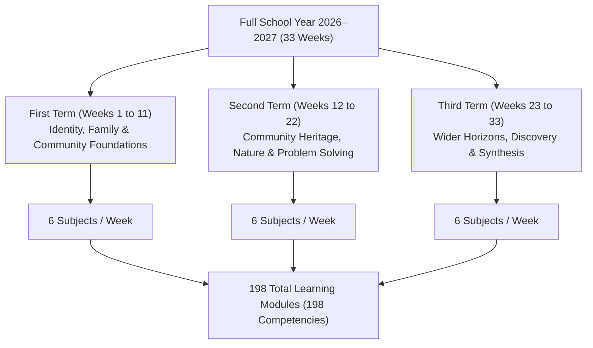

# Grade 3 Online Learning Hub ("Reading HUB") — Complete System & User Guide

**School:** San Vicente Elementary School  
**Division:** SDO Romblon  
**Class / Section:** Grade 3 - Section Masinadyahon  
**School Year:** 2026–2027  
**Curriculum Standard:** DepEd MATATAG Curriculum (Budget of Work)

---

## 🌟 Application Access & Credentials

The platform is running live as a full-stack web application at:
👉 **`http://localhost:5000`**

### 👩‍🏫 Teacher Credentials
- **Username:** `teacher`
- **Password:** `teacher123`
- **Name:** Teacher Nikay (Teacher A)
- **Role:** Administrator & Classroom Teacher (Full Access to Control Center)

### 👦👧 Student Demo Credentials (Grade 3 Learners)
All demo student accounts are protected with student-friendly PIN passwords:

| Student Name | Username | Password | Stars | Streak |
|---|---|---|---|---|
| **Juan Dela Cruz** | `juan.delacruz` | `student123` | 18 ⭐ | 4 Days 🔥 |
| **Maria Santos** | `maria.santos` | `student123` | 24 ⭐ | 5 Days 🔥 |
| **Gabriel Reyes** | `gabriel.reyes` | `student123` | 12 ⭐ | 2 Days 🔥 |
| **Althea Mendoza** | `althea.mendoza` | `student123` | 30 ⭐ | 6 Days 🔥 |
| **Mateo Garcia** | `mateo.garcia` | `student123` | 15 ⭐ | 3 Days 🔥 |

---

## 📚 Curriculum Structure & Coverage

The platform encompasses **all 33 instructional weeks** of the official Grade 3 school year across **3 Terms**, covering all **6 core learning areas**:

### The 6 Learning Areas (Every Week):
1. 🇬🇧 **English** — Reading, Phonics, Vocabulary, Grammar, Text Types, and Comprehension.
2. 🇵🇭 **Filipino** — Palabigkasan, Pagbasa, Wika, Talasalitaan, at Pakikipagtalastasan.
3. 🤝 **GMRC** (Good Moral and Right Conduct) — Pagpapahalaga sa sarili, kapwa, pamilya, at pamayanan.
4. 🗺️ **Makabansa** — Kasaysayan, kultura, heograpiya, pamumuno, at sining ng Pilipinas.
5. 📐 **Mathematics** — Numbers, fractions, geometry, area estimation, measurement, and word problems.
6. 🔬 **Science** — Living things, matter, forces, weather, earth, and environmental care.

---

## 🎯 8-Part Subject Module Framework & Daily 5-Day Flow

Every single one of the 198 subject modules follows a pedagogically sound 8-part sequence designed for Grade 3 cognitive development:

| Part | Component | Day Structure | Description & Interactive Features |
|---|---|---|---|
| **1** | 🎯 **Competency** | **Day 1** | Displays official DepEd MATATAG competency code, description, and focus areas. |
| **2** | 💡 **Let's Learn** | **Day 1** | Core interactive lesson explanation with **Text-to-Speech audio reader** for early learners. |
| **3** | 🔎 **Let's Explore** | **Day 2** | Guided examples, step-by-step illustrations, and vocabulary flashcards. |
| **4** | ✏️ **Let's Practice** | **Day 3** | Formative interactive exercises with immediate feedback and explanation hints. |
| **5** | 🎮 **Let's Play** | **Day 4** | Gamified quiz, matching, or puzzle mini-game with score animations. |
| **6** | ⭐ **Challenge Me** | **Day 4** | Higher-order thinking question testing real-world application. |
| **7** | 📝 **Show What You Know** | **Day 5** | 5-item summative assessment evaluating mastery across the week's lesson. |
| **8** | 🏆 **My Result** | **Summary** | Instant report card showing score percentage, stars earned, and mastery status. |

---

## 🔐 Teacher Command Center & Control Features

Teachers have complete supervisory power over learning progression:

1. **Week Access Control (API & Database Level):**
   - Toggle any week from **Week 1 to Week 33** between **Unlocked (Open)** and **Locked**.
   - Changes take effect instantly across all student screens.
   - If a student attempts to navigate directly to a locked week, the server returns an HTTP `403 Forbidden` with a friendly lock prompt.
2. **Student Roster Management (CRUD):**
   - Register new learners with custom usernames, names, and avatar characters.
   - View detailed individual profiles, total stars, streaks, completed activities, and average scores.
3. **Automated Remediation Center:**
   - The platform continuously detects learners scoring **below 75%** on any competency.
   - Teachers can assign customized remediation notes and follow-up activities with 1 click.
   - Once the student achieves mastery, the alert can be marked resolved.
4. **Academic Performance Reports:**
   - **Term Reports:** Granular breakdown for Term 1, Term 2, or Term 3 per student and per subject.
   - **Full 33-Week School Year Consolidated Report:** Aggregates Term 1 + Term 2 + Term 3 into a final general average.
   - **1-Click CSV Export:** Generates official formatted CSV files ready for school records, DepEd Form 137 / SF9 preparation, and parent conferences.

---

## 🎨 Visual & Audio Design

- **Pixar-Inspired 3D Aesthetic:** Soft tactile card shadows, rounded corners (`border-radius: 20px`), playful pill badges, and vibrant pastel-gradient backgrounds.
- **Child-Friendly Typography:** Styled with rounded sans fonts (`Fredoka` & `Nunito`) for maximum readability.
- **Web Audio Sound Effects:** Synthesized audio chimes for correct answers, try-again prompts, and celebratory confetti upon achieving perfect scores.
- **Read Aloud:** Built-in browser speech synthesis button on lessons to support emerging readers in both English and Tagalog contexts.
